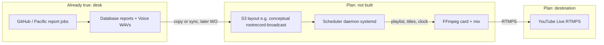

# FUTURE PLAN — RootRecord 24/7 broadcast channel

| Field | Value |
| --- | --- |
| **Date (HST)** | 1 October 2026 |
| **Kind** | FUTURE PLAN. Not a work order. Not a license to start a stream, buy AWS, or turn a job on. |
| **State** | PROPOSED — capture only |
| **Proposed by** | Alexander (concept); Library write-up for review |
| **Needs sign-off from** | Alexander, before any later work order |
| **Related WO** | none yet. Ancestor: [WO-RPT-001](../06-development/Work-Orders/Complete/WO-RPT-001-Reports-Worklog-Domain-Import.md) Phase F (radio / live-stream **deferred**). Do not treat this page as completing that phase. |
| **Related ideas** | [Restore voice reports](./2026-09-29-restore-voice-reports.md) (local Kokoro **LANDED**; this YouTube plan is still off). [AWS Mainland improvement](./2026-09-29-aws-mainland-improvement-plan.md) and [AWS fallback rebuild](./2026-09-29-aws-fallback-rebuild.md) are older continuity notes. Mainland One is radio as of 2026-10-01. Earthquake and hurricane voice reports stay Pacific poller jobs. |

This page is **plan**. Rows labeled **already true** are checked against Library on `main` and Pacific `Reports/` / `Media/` as they stood on GitHub when this was written. If a WAV is not proven on disk from this checkout, this page says so.

---

## 1. Intent and non-goals

**Intent (plan):** a 24/7 RootRecord news/radio channel that **assembles a program from reports RootRecord already generates**. The stream never really ends. New report files can enter the hour without restarting the live connection.

**Heart of v1 (plan):** FFmpeg + a playlist/scheduler daemon (Python or Node, systemd) on a modest broadcast EC2. Not AWS MediaLive.

**What it reuses (already true, then plan):** Pacific `Reports/` is already documented as the intake spine for a later radio / live-stream layer. That README says the radio/stream pipeline is **deferred**. Voice reports already write text and, when Kokoro runs, WAVs under Database `Media/Audio/Voice/`. This plan consumes those products. It does **not** start a second content factory.

**Nothing starts until Alexander signs a later work order.** This page does not:

- edit Pacific, Database, Ecosystem, or Mainland
- enable any `RR_*` flag
- restart the poller
- create S3 buckets, EC2, IAM, MediaLive, or CloudFront
- store a YouTube stream key
- spend money
- turn on speakers, Icecast, or OBS

### Non-goals (v1)

| Leave out | Why |
| --- | --- |
| AWS MediaLive as the encoder | Alexander: FFmpeg is the heart of v1 |
| A new report-writing stack | Reports already exist; broadcast **programs** them |
| Restoring old AWS radio (`rr-radio`, `rr-icecast`, `rr-youtube`) | Those Mainland units are **already true** as **not running**; bins are not in the Mainland repo. This plan is a new YouTube Live path, not a revive of Icecast |
| OBS WebSocket / hurricane OBS (WO-MIG-20) | Overlay sender is a different, unsigned draft. Video here is an FFmpeg card |
| Local speakers (`RR_PLAYBACK`, `aplay`) | Desk playback is Alexander-only and stays off |
| Cloud Ara TTS spend (`RR_CLOUD_TTS`, `--speak`) | Optional later; default voice remains Kokoro on the desk |
| AI programming director | v3 only |
| Using `rootserver.rootrecord.cloud` as the site or the stream | That host is the **poller tunnel** (already true) |
| Putting this on the current t3.micro globe/fallback node without a separate decision | That instance is **already true** as ~908 MB RAM continuity; FFmpeg + live encode is a different workload |

Old names that are **not** this channel (already true):

- **WO-MIG-47 DirectoryBrowser** — local listing CLI. Old `operations/broadcast.py` was a file server, not YouTube Live.
- **WO-MIG-19 HurricaneRadio** — dry-run handoff of `hurricane_desk` to `Media/Playback`. Speakers and AWS radio stay off.
- **`www.rootrecord.cloud`** — the public site on Vercel. Not the live stream. The stream is `https://radio.rootrecord.cloud/radio/live.mp3`.

---

## 2. v1 architecture (plan)



Boxes:

1. **Report pipeline (already true)** — poller jobs and on-demand scripts write markdown and, for voice kinds, optional WAVs.
2. **Object store (plan)** — conceptual prefixes `reports/`, `music/`, `sounds/`. Bucket name `rootrecord-broadcast` is an example, not a created resource.
3. **Broadcast server (plan)** — a **modest, dedicated** EC2 (not assumed to be the existing Ohio t3.micro). Daemon: read available reports, build playlist, insert music and chimes, keep a simple visual, pipe to FFmpeg, watch the process, restart FFmpeg if it dies. New files are picked up **without** tearing down the RTMPS session if FFmpeg concatenation / concat demuxer (or a looping playlist rewrite) allows it — exact mechanism is a later engineering choice.
4. **Visual (plan)** — FFmpeg only: wordmark **ROOTRECORD**, current report title, clock in **HST**, site line **https://www.rootrecord.cloud/**. Animated background is a generated loop or still, not a studio.
5. **YouTube Live (plan)** — one never-ending live event. Stream key lives only on that host, never in git.

**Public URL (already true, verified in Library):** production site is `https://www.rootrecord.cloud/` (Vercel from `RootRecord-Website`, source Pacific `Website/Home/`). Library `main` has **no** `github.io` public site. Do not print `rootrecord-software-solutions.github.io` on the card. Do not print `https://rootserver.rootrecord.cloud/` on the card; that is the poller.

Mainland One is radio only. `ssh.rootrecord.cloud` is retired. Desk SSH is `ml1.rootrecord.cloud`. The listener stream is already `https://radio.rootrecord.cloud/radio/live.mp3`. This YouTube plan is not that station. The live Mainland host is playing the Opus music bed.

---

## 3. Program clock and fallback (plan)

Desk clock is **HST** unless Alexander changes it. Sketch for one hour:

| Minute (HST) | Segment |
| --- | --- |
| :00 | Time chime |
| ~:01 | Station open: “RootRecord News” |
| after open | Latest report (priority: newest eligible voice or spoken digest) |
| | Background music |
| | Technology-shaped report (see mapping below — **plan**, not a live desk named Technology) |
| :30 | Half-hour chime |
| | Security report |
| | Music |
| | Business-shaped report |
| :59 | Station ID |

Between those posts: **music, report, music, time chime, music, report, top-of-hour chime, station ID**.

**Fallback (plan):** if no new reports, rotate existing eligible objects so the channel can run indefinitely. v1 rotation is dumb: skip anything played in the last N hours if another item exists; if the library is tiny, replay is allowed. Do not invent news. Do not call a model to fill dead air.

**Breaking interrupt (open decision):** v1 can stay clock-only. A later interrupt would jump the playlist for `priority` ≈ 100 without restarting FFmpeg.

Chime **files** on the desk (already true): 48 hourly/half-hour WAVs exist; job `voice_hourly_chime` stays **off** until `RR_VOICE_HOURLY_CHIME=1`. Broadcast chimes would be **copies** of those files (or new beds), not enabling the desk chime job.

---

## 4. Conceptual S3 layout and broadcast-object manifest — PROPOSED

**PROPOSED contract.** No bucket exists. Do not create one from this page.

```text
s3://rootrecord-broadcast/          # example name
  reports/                          # audio (+ optional sidecar .md / .json)
  music/                            # licensed beds only (open decision)
  sounds/                           # chimes, station ID, beds
  manifests/                        # one JSON per object (v2)
  current/                          # optional: scheduler scratch, not git
```

**PROPOSED** v2 JSON (v1 may be “directory of WAVs + a clock table” with no JSON):

```json
{
  "id": "security_desk_2026-10-01T11:11-10:00",
  "title": "Security desk",
  "audio_path": "reports/security_desk_current.wav",
  "duration_s": 42.0,
  "priority": 50,
  "published": "2026-10-01T11:11:00-10:00",
  "expires": null,
  "categories": ["security"],
  "broadcast": true
}
```

**PROPOSED** priority bands: breaking ~100, daily ~50, evergreen ~10.

`broadcast: false` means the object may exist in S3 for archive and must not air.

---

## 5. What already exists (consume this; do not contradict it)

### 5.1 Reports taxonomy

Pacific `Reports/README.md` (**already true**): worklog spine; News; report board; Economy-Brief; CloudNarrative; Late-Final; AI-Usage; `ai_processing_report.py`; template fill. Radio/stream **deferred**.

The Library handbook for those Database folders lives on the desk at `Guides & Tutorials/Database-Logs-and-Reports-Maintenance.md` (flat file under Guides & Tutorials; update it there). Treat Pacific README + the rows below as the verified list for this plan; the handbook is the operator map for Logs / Reports / Worklog.

| Product | Writer (Pacific) | Typical output | Audio today? | Gate / job (do not enable from this plan) |
| --- | --- | --- | --- | --- |
| Worklog / daily roll-up | `Reports/scripts/worklog_*.sh`, `daily_roll_up.sh` | Database `Worklog/` + Library session copy | **No** — markdown | `worklog_scan`, `reports_daily_roll_up` (live ops; not a broadcast job) |
| Template ops reports | `Reports/template_fill.py` | `test-reports/Templates/` markdown | **No** | `RR_TEMPLATE_REPORTS` (off unless set at poller start) |
| AI processing report | `Reports/ai_processing_report.py` | markdown metadata report | **No** | `RR_AI_REPORT` (job in `jobs.py`, gated off) |
| AI-Usage ledger | `Reports/AI-Usage/scripts/` | JSON / markdown spend summary | **No** | `RR_AI_USAGE` (off) |
| Economy-Brief | `Economy-Brief/scripts/economy_brief.py` | daily markdown; Discord off | **No** | `RR_ECONOMY_BRIEF` **PROPOSED**, not in `jobs.py` |
| CloudNarrative | `CloudNarrative/scripts/cloud_narrative.py` | prose package; dry-run default | **No** until separately rendered | `RR_CLOUD_NARRATIVE_SPEND` — spend off; `XAI_API_KEY` may be absent |
| News (Hawaiʻi + state builders) | `Reports/News/` | SQLite + `*-news-last.json` | **No** | `RR_HAWAII_NEWS` / `RR_STATE_NEWS` / `RR_GLOBAL_NEWS` **PROPOSED**, not in `jobs.py` |
| Late-Final | `Late-Final/scripts/late_final.py` | text late roll-up 23:30 | **No WAV in the late-final runner** (text). Same template as `late_report` | `RR_VOICE_LATE_FINAL` off |
| Report board | `Reports/scripts/report_board.py` | due ledger JSON; `--voice` can render WAV, never plays | only if `--voice` | `RR_REPORT_BOARD` **PROPOSED** |

### 5.2 Voice reports — possible **audio** sources later

Living schedule: [2026-09-30 voice desk](../01-operations/2026-09-30-voice-desk.md). Engine: [Voice-Reports-G3](../10-AI-and-Agent-Runtime/Voice-Reports-G3.md).

**Already true:** Kokoro-82M, on demand, not a resident server. Output 24 kHz 16-bit mono WAV under Database `Media/Audio/Voice/<name>_current.wav`. Sandbox Telegram delivery can be on. **Speakers stay off.** **AWS radio is not wired.** Alexander-only to enable more voice jobs or speakers.

This checkout cannot see the live Database, so this page does **not** claim a given `_current.wav` is on disk tonight. Scripts and jobs exist; WAV presence is “when that job last rendered and was not skipped.”

| Clock (HST) | Persona | Kind | Default on desk? | Broadcast mapping (plan) |
| --- | --- | --- | --- | --- |
| :03 | Carly | `kilauea_report` | on | geology / “latest” pool |
| :04 | Bruce | `solar_desk` | on | technology / energy |
| :06 | Bruce | `system_perf` | on | technology |
| :07/:22/:37/:52 | Ava | `nws_weather` | on | weather / latest |
| :08 | Carly | `earthquake_report` | on | geology |
| :11 | Carly | `security_desk` | on | **security** slot |
| :12 | Carly | `bandwidth_desk` | on (send waits for a sample window) | technology |
| :15/:45 | — | energy look (no voice note) | on | not a segment |
| :32 | Bruce | `remaining_tasks` | on | skip public air unless Alexander says otherwise (desk internals) |
| :00/:30 | chimes | files exist | **job off** | **sounds/** for the clock |
| hurricane | Carly | `hurricane_desk` | **off** `RR_VOICE_HURRICANE` | weather / breaking when on |
| 09:02 / 12:02 / 21:02 | Ava | morning / midday / late | **off** `RR_VOICE_ROLLUPS` | “latest” / station blocks |
| official weather | Ava | `official_weather` | job **not in jobs.py** | weather |
| boot brief | Ava | `boot_brief` | job **not in jobs.py** | skip 24/7 loop |
| energy spoken | Carly | `energy_report` | listed on in Voice-Reports-G3 | energy / technology |

`remaining_tasks` and host `system_perf` may be **too internal** for a public YouTube. Open decision.

Markdown-only products (News JSON, Economy-Brief, AI report, worklog, CloudNarrative) need a **new speech render** before they can air. That render is not v1 unless Alexander adds it in a later WO. v1 can run on **existing voice WAVs + music + chimes** only.

### 5.3 AWS / YouTube today

**Already true:** US-Mainland is the AWS lane (globe, tunnel, fallback profile). Legacy units `rr-audio-recv`, `rr-icecast`, `rr-radio`, `rr-youtube` are documented **not running**. There is **no** MediaLive channel in Library. There is **no** live RootRecord YouTube encoder in Library. Old Grok `ecosystem_report.py` YouTube-chapter helper was **not** ported (WO-MIG-37).

---

## 6. Phased path

Each phase names what must **not** turn on early.

### v0 — this page (now)

Library document only. **Must not:** runtime code, jobs, spend, AWS resources, YouTube key, poller restart, speakers.

### v1 — dumb scheduler + FFmpeg + YouTube (later WO)

Playlist from files + a fixed HST clock. Concat music/chimes. FFmpeg card. systemd restart of FFmpeg. **Must not:** MediaLive; AI director; `RR_CLOUD_TTS` live speak; `RR_PLAYBACK=1 --play` on the Hawaii desk; `RR_CLOUD_NARRATIVE_SPEND`; enabling `RR_HAWAII_NEWS` / `RR_AI_REPORT` / roll-ups **only to feed the station** without a named WO; poller restart “because broadcast”; putting the encoder on the 908 MB micro without a capacity sign-off.

### v2 — manifests and priority (later)

JSON contract above. `broadcast` flag. Breaking vs daily vs evergreen. Scheduler reloads manifests without restarting the YouTube session. **Must not:** require the AI director; silent expiry that deletes Database originals.

### v3 — AI programming director (later)

Avoid recent replays, shape the hour. **Must not:** invent facts; spend unbounded tokens; bypass Carly seal / honesty rules for public speech; run a resident model on the encoder if the desk NPU is the inference home.

WO-RPT-001 Phase F (digests → seal → Ava voice / overlay / radio) stays a **separate** design. This channel can consume sealed WAVs; it does not replace the seal.

---

## 7. Open decisions for Alexander

1. **YouTube channel** — which account, brand, unlisted vs public, monetization, 24/7 ToS.
2. **Music licensing** — what files may sit in `music/`. No bed goes on air without a license answer.
3. **Voice / TTS** — public air of Kokoro Ava/Bruce/Carly vs a dedicated station voice vs text-to-speech of markdown News. Cloud Ara is spend.
4. **Who operates the EC2** — new instance vs later resize of Mainland vs a non-AWS box. Current Ohio micro is continuity + globe, not this encoder.
5. **HST clock** — keep HST on the card for a worldwide YouTube?
6. **Breaking-news interrupt** — clock-only v1 vs jump-in for hurricane / NWS?
7. **What is public** — security desk, remaining tasks, system RAM: on-air or desk-only?
8. **Copy path** — GitHub release artifact vs rsync vs S3 sync from Database. Secrets stay out of git.
9. **Station ID copy** — legal name vs ROOTRECORD vs `www.rootrecord.cloud`.
10. **Relationship to Icecast / old radio** — retire the old units in place, or a later dual-output WO.

---

## 8. Operator one-liner

RootRecord already writes reports (many as markdown, some as Kokoro WAV). This plan is a **later** YouTube Live loop that programs those files with FFmpeg. It is not on tonight. It is not MediaLive. It is not the poller URL. It is not the Vercel homepage. It does not start until you sign a work order.
