# Root Monitor — Operator's Handbook

Pacific Solar Server desk panel. Written for someone sitting at the machine who needs to see the site, change a setting on purpose, and leave the stack running.

**Captured:** Wednesday 30 September 2026, 03:07–03:08 HST, from the live window on this desk.
**App:** Root Monitor (`cloud.rootrecord.ControlPanel`), GTK4 + libadwaita. Renamed from "RootRecord Control Panel" on 29 September 2026. The folder and file names did not change.
**Screenshots:** `media/` next to this file. Every page and every Settings sub-page. The app's own secret guard checked each picture before it was saved (0 matches).

This handbook is a picture of one night. Battery percentages, log ages, and "PASS" dots will be different when you open it tomorrow. The layout, the buttons, and the rules will not.

---

## What this program is

Root Monitor is the native control panel for the Pacific Solar desk. It sits beside the poller. It does not replace `poller-dashboard.py`, `poller-watch.py`, the ENERGY status line, or `npu-status.sh`. Those keep working exactly as they did.

It is a window on the desk. There is no browser, no Chromium, no Electron, and no network server inside the panel. Almost everything you see is read from files the stack already writes: JSON under Energy and System, the automations log, systemd, `/proc`, and `~/.ssh/config`.

Two places write:

- **Settings** writes a file after you confirm. It takes a backup first. It does not restart anything.
- **AWS Fallback**, while `aws_fallback_mode` is `write`, writes one flag file on AWS after you confirm. On this desk that mode is **write**.

Closing the window closes only the panel. The poller keeps running.

A second launch does not open a second copy. It raises the window that is already open.

---

## How to open it

| Way | What happens |
| --- | --- |
| Desktop launcher | `Root Monitor` on the desktop (`Root-Monitor.desktop`) |
| App menu | **Root Monitor** |
| Login | `~/.config/autostart/root-monitor.desktop`, about 10 seconds after login |
| Stack reload | `do-stack-reload.sh` opens this window. It does not start the poller. `OPEN_POLLER_WINDOW=0` skips the window. |
| Terminal | `python3 "/home/rootrecord/RootRecord-Ecosystem/1 - Servers/1 - RootRecord-Pacific-Solar-Server/Apps/Control-Panel/rr_control_panel.py"` |

The old terminal dashboard is still in the app menu as **Poller Dashboard (terminal)**.

To put the old terminal viewer back as the login window:

```bash
bash "/home/rootrecord/RootRecord-Ecosystem/1 - Servers/1 - RootRecord-Pacific-Solar-Server/Apps/Control-Panel/Packaging/swap-default-viewer.sh" revert
```

`apply` on that same script is what made Root Monitor the login viewer (applied 30 September 2026, 02:33 HST).

---

## The window, once

The window opens at about 1100×760. A header bar says **Root Monitor**. Under it, one status line never leaves. On the left, a sidebar. On the right, the page you picked. The first page is **Energy**.


### The status line

Read it before you read the page. On this capture it said:

> Root Monitor · Pacific Solar Server · poller **PASS** (1 proc) · B1 15% · B2 1% · B3 laptop 100% · log 37s · Wed 30 Sep 2026 03:07:18 HST

| Piece | Meaning |
| --- | --- |
| **poller ● PASS / WARN / FAIL** | Same rule as the terminal dashboard. Green PASS, amber WARN, red FAIL. The number in parentheses is how many poller processes were seen. |
| **B1** | River 2 Pro state of charge, rounded. |
| **B2** | Delta 2 state of charge, rounded. |
| **B3 laptop** | This computer's own battery, from sysfs. This is the laptop, not the Delta 2 expansion pack. |
| **log Ns** | Seconds since `automations_current.log` was last written. A climbing number means the poller log has gone quiet. |
| **clock** | Hawaii time, updated with the header. |

The header refreshes every 5 seconds, whichever page you are on. The page body refreshes only while you are looking at it. Leave a page and its timer work stops. That is why Starlink, camera stills, and the AWS page do not run in the background.

### Sidebar

Top to bottom:

1. Energy
2. Weather
3. System
4. NPU
5. AI log
6. Poller / services
7. Running
8. Network
9. SSH
10. AWS Fallback
11. Cameras
12. Controls
13. Not migrated
14. Settings

Click a name. The page builds the first time you visit it, then stays until you leave the ones that are released on purpose (AWS Fallback, and each Settings or Not-migrated sub-page).

### How to read the bars

Batteries and the host do not share a color scale.

**Charge** (B1, B2, the laptop): low is bad.

| Fill | Color |
| --- | --- |
| under 20% | red |
| 20% to 50% | amber |
| over 50% | green |

**Use** (CPU, RAM): low is good. Red starts at 80%.

| Fill | Color |
| --- | --- |
| under 50% | green |
| 50% up to 80% | amber |
| 80% and above | red |

On this capture, B1 at 15.1% is red because the River is low. B3 at 100% is a full green bar because the laptop is on AC and full. CPU at 5.4% is a short green bar. RAM at 69.9% is amber, because 70 is under the 80% red line.

### On / off controls are buttons

There are no switches. A button reads `Name: On` in green or `Name: Off` with a red outline. A click asks you to confirm, then writes. Camera, Starlink, panel, feature flags, relay, and AWS rows all use this button.

---

## A five-minute look when you sit down

Do this in order. You are only reading.

1. **Header.** Poller PASS, and the log age is a small number of seconds. If the log age is climbing through minutes, go to Poller / services before anywhere else.
2. **Energy.** B1 and B2 ages. The word **STALE** means that pack's last sample is older than 15 minutes (`stale_after_sec`, default 900). Watts tell you whether anything is actually moving.
3. **Poller / services.** Eight rows. You want green. Open the log only if a row is not green.
4. **Running.** The poller pid should be there, with children under it. Ollama is listed further down.
5. **Cameras** only if you need eyes on the array. The viewer starts off. Turning it on does not start or stop the cameras. It only shows stills this window already has on disk.

Then stop. Controls and AWS Fallback are for a deliberate change, not a glance.

---

## Energy


Three cards.

### Batteries

Same three bars as `poller-dashboard.py`.

| Bar | Device | On this capture |
| --- | --- | --- |
| **B1** | EcoFlow River 2 Pro | **15.1%**, red. Sample **0m41s ago**, source `ble`. Not stale. |
| **B2** | EcoFlow Delta 2 | **1.0%**, red. Sample **2h14m ago · STALE**, source `api`. |
| **B3** | This laptop | **100.0%**, green. **Full · AC** from sysfs. |

Under the bars: the Delta 2 expansion pack. The status line's own B3 field was absent, so the panel says the expansion battery is not in the current status line. Do not confuse that line with the laptop bar. Laptop B3 is always the computer. Expansion B3 is a field inside the poller's ENERGY heartbeat, and it was missing at 03:07.

The detail under each EcoFlow bar is age, source (`ble` or `api`), and the SUMMARY fragment from the log (`soc`, watts, `db=ok`).

### Watts

One row per pack, from `Energy/watts/*-last.json`.

| | River 2 Pro | Delta 2 |
| --- | --- | --- |
| solar in | 0 W | 0 W |
| AC out | 38 W | 57 W |
| AC in | 0 W | 0 W |
| USB-C out | 14 W | 0 W |
| charge source | none | none |
| source | ble | api |
| at | 03:06:39 HST | 00:53:04 HST |

Night, so solar in is zero. The River is still supplying a small AC and USB-C load and its sample is current. The Delta's watts row is as old as its SOC sample (00:53). Treat that row as last-known, not live.

### Poller status line

The newest `ENERGY` line from the tail of `Logs/Automations/automations_current.log`, then any `SUMMARY=` lines, then `SUN`.

At 03:07 the heartbeat was live: `B2=1% B1=15.3% solar=0 W ac=57 W usbc=0 W`, laptop `LAP=100%/Full/AC`. `SUN` was a dash because the NOAA solar table was not available (same gap as the Weather page).

**What to do with a STALE pack:** the panel is showing you the gap. It does not reconnect BLE or call the EcoFlow API. The reader is `ava-ecoflow-ble.service` and the EcoFlow jobs. Check Poller / services (BLE should be PASS) and Running (the `ble-owner.py` process). A stale API sample with a live BLE sample on the other pack is a normal split: each pack has its own source.

---

## Weather

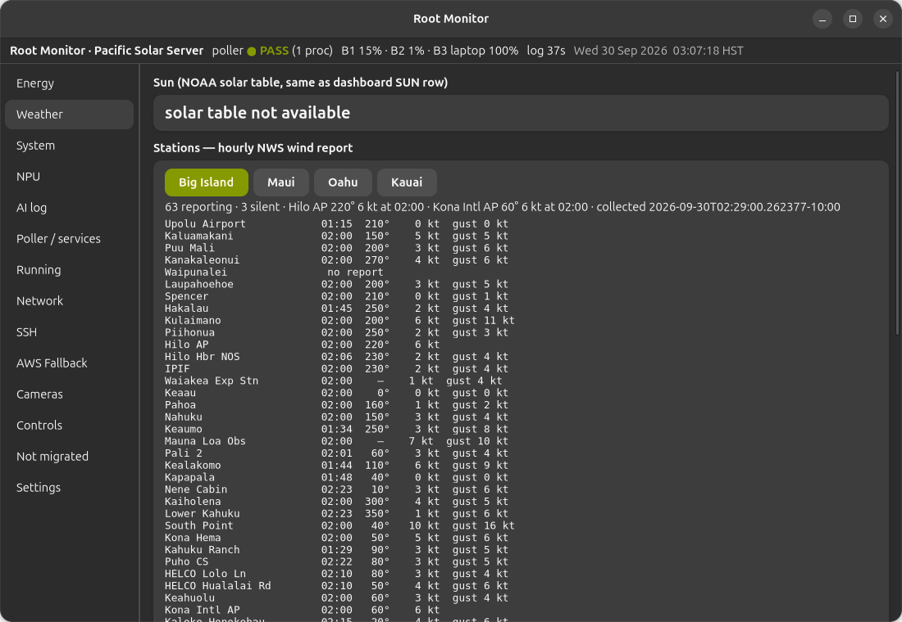

Three cards. The island defaults to **Big Island**.

**Sun** uses the same NOAA solar table as the dashboard SUN row. On this capture: `solar table not available`. When the table is present, this line is the sun state in large type.

**Stations** is the hourly NWS wind report (`oso_hourly_obs_current.md`). Four buttons sit on the card: **Big Island**, **Maui**, **Oahu**, **Kauai**. The selected one is green. A click saves `weather_zone` immediately, so the next launch stays on that island. Big Island is the file's "Hawaii" group.

On this capture the summary read:

> 63 reporting · 3 silent · Hilo AP 220° 6 kt at 02:00 · Kona Intl AP 60° 6 kt at 02:00

The list under that is every station for the island, in the order NWS prints them: location, time, direction, speed, gust. A station with no observation says `no report`. Scroll for the rest, including Kona. Maui, Oahu, and Kauai are the same report filtered to that island. The headline station on those islands is Kahului AP, Honolulu AP, and Lihue.

**Zone forecast** is still Today, Tonight, and advisories, when `zfp_zone_forecast_current.md` is on disk. For Big Island it uses the blocks whose titles contain "Big Island" (windward and leeward). That file was not on disk at capture, so the card says so and points you at the station list. The state report's generated time is appended when `Hawaii_State_Weather_Report_current.md` is present.

**Open weather reports folder** opens that reports directory.

The same island name is on **Settings → Panel** as "Weather island". The buttons on this page are the control you use.

---

## System

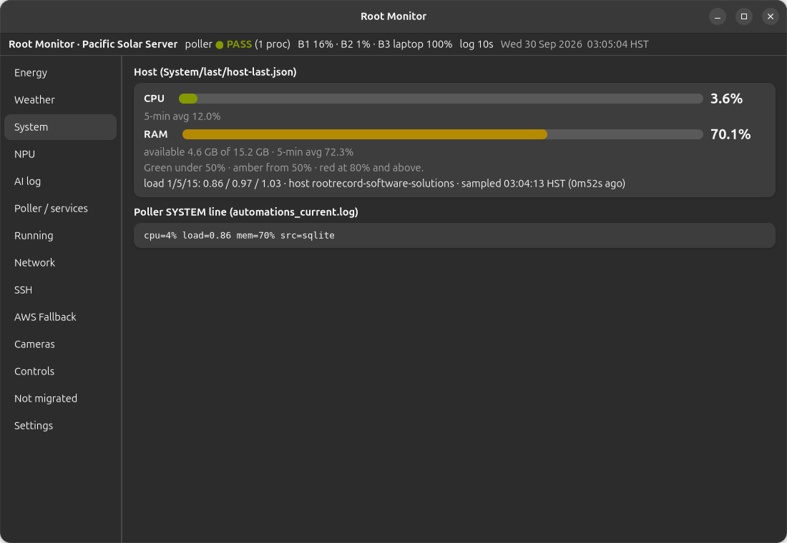

**Host** reads `System/last/host-last.json`.

| | This capture (03:07 HST) |
| --- | --- |
| CPU | 5.4% (5-minute average 10.1%). Short **green** bar. Under 50% is quiet. |
| RAM | 69.9% used. 4.6 GB available of 15.2 GB. 5-minute average 70.2%. **Amber**, because 70 is between 50 and 80. |
| Load | 0.72 / 0.90 / 0.99 |
| Host | `rootrecord-software-solutions` |
| Sampled | 03:06:40 HST, 42 seconds old |

The line under the bars states the scale: green under 50%, amber from 50%, red at 80% and above. A red CPU or RAM bar means that number is at least 80%.

**Poller SYSTEM line** is the latest SYSTEM heartbeat in the automations log. Here: `cpu=5% load=0.72 mem=70% src=sqlite`.

If the host card and the SYSTEM line disagree by a lot, the host card is the JSON sample and the line is whatever the poller last wrote. Both ages are on screen. Trust the newer one, then look at Poller / services if the log age in the header is large.

---

## NPU

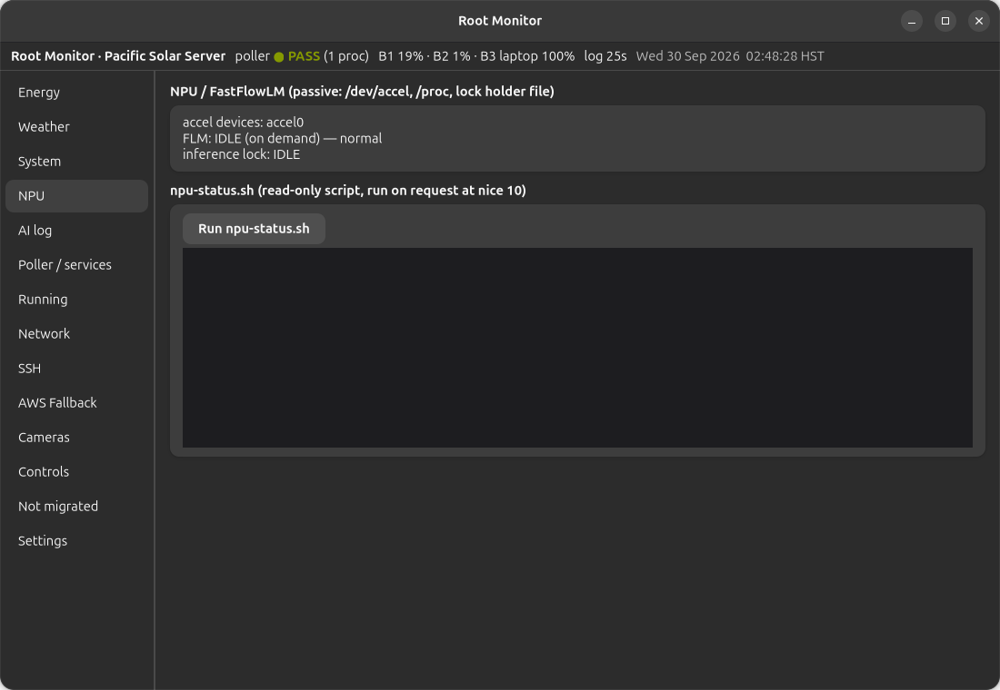

Passive. Nothing runs until you press the button.

| Line | This capture | Meaning |
| --- | --- | --- |
| accel devices | `accel0` | `/dev/accel` is present. `none` would mean the device node is missing. |
| FLM | `IDLE (on demand) — normal` | FastFlowLM is not serving. It starts when something asks. Port default **52625**. |
| inference lock | `IDLE` | No one holds the lock file. |

**Run npu-status.sh** runs that script once, at `nice 10`, and prints into the dark box. The button greys out while it runs. This is read-only. The same button exists on Controls; that one jumps here and runs the script.

Leave the page and the passive lines stop refreshing. The script does not keep running.

---

## AI log

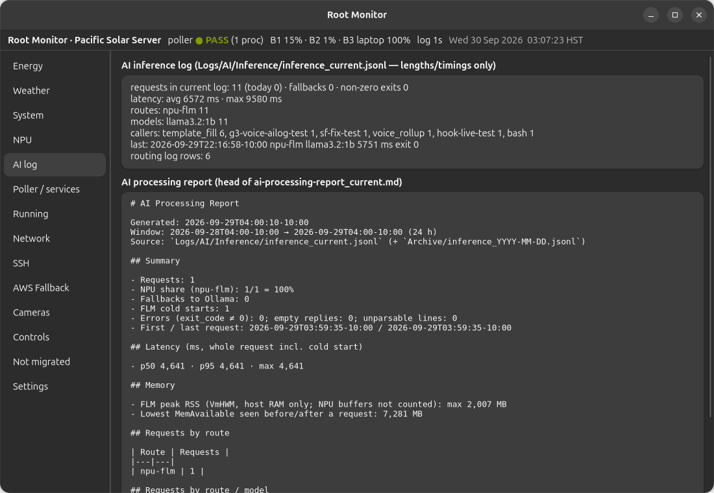

Counts and timings only. Prompt text is not shown.

From `Logs/AI/Inference/inference_current.jsonl` (re-read only when size or mtime changes), plus the routing log and the head of `ai-processing-report_current.md`.

On this capture:

- **11** requests in the current log, **0** of them today (the capture is just after midnight; the last request was 29 September, 22:16 HST).
- **0** fallbacks, **0** non-zero exits.
- Latency average **6572 ms**, max **9580 ms**.
- All 11 requests took route `npu-flm`.
- Model counts: `llama3.2:1b` eleven times.
- Callers included `template_fill`, `g3-voice-ailog-test`, `sf-fix-test`, `voice_rollup`, `hook-live-test`, and `bash`.
- **6** routing-log rows.

The report card underneath is the top of the daily AI processing report: request share on the NPU, fallbacks to Ollama, cold starts, error counts, latency percentiles, and peak RSS. Scroll the page for the rest of the head. It is the start of the markdown file, not a live chart.

A request "today" of 0 in the middle of the night is fine. A request count that never moves across a day when you expected inference is the thing to notice.

---

## Poller / services

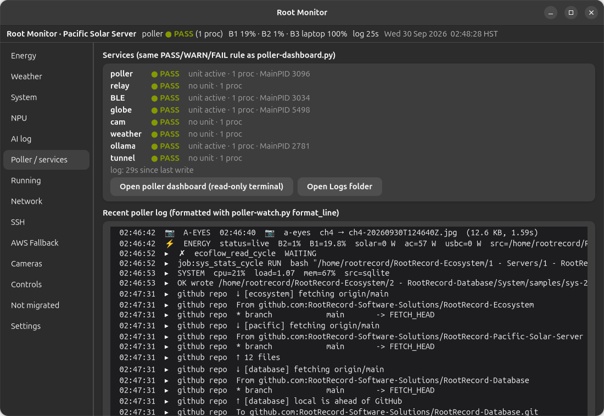

Same eight rows and the same PASS / WARN / FAIL rule as `poller-dashboard.py`.

| Row | How it is judged | This capture |
| --- | --- | --- |
| **poller** | user unit `rr-rootserver-poller.service` plus the `rootserver_poller.py` process | PASS · unit active · 1 proc · MainPID 3096 |
| **relay** | process `council-relay.py` (no unit) | PASS · no unit · 1 proc |
| **BLE** | user unit `ava-ecoflow-ble.service` | PASS · unit active · 1 proc · MainPID 3034 |
| **globe** | user unit `network-globe-hawaii.service` | PASS · unit active · 1 proc · MainPID 5498 |
| **cam** | process `cam_server.py` (no unit) | PASS · no unit · 1 proc |
| **weather** | process `run_poller.py` (no unit) | PASS · no unit · 1 proc |
| **ollama** | system unit `ollama.service` | PASS · unit active · 1 proc · MainPID 2781 |
| **tunnel** | a `cloudflared` process (no unit of its own; the poller starts it) | PASS · no unit · 1 proc |

"no unit" is normal for relay, cam, weather, and tunnel. They are processes the poller or a script owns. FAIL on those means the process was not found. FAIL on a unit row means the unit is not active or the process count is wrong.

Under the grid: seconds since the automations log was written. Here, 4 seconds.

**Open poller dashboard (read-only terminal)** opens `poller-dashboard.py` in a new ptyxis window. It does not call `open-poller-window.sh`, because that script also runs `systemctl --user start`. If a dashboard is already open, the panel shows a toast and leaves it alone.

**Open Logs folder** opens the Logs directory.

**Recent poller log** is the last lines of the automations log, formatted by `poller-watch.py`'s `format_line`. On this capture you can see A-EYES writing a channel-4 still, an ENERGY line, a SUMMARY for the River, a SYSTEM sample, and a GitHub sync. The ecosystem repo was ahead of GitHub. That is information, not a button. Root Monitor does not push.

How many lines: `log_lines` in Settings → Panel, default 40.

---

## Running

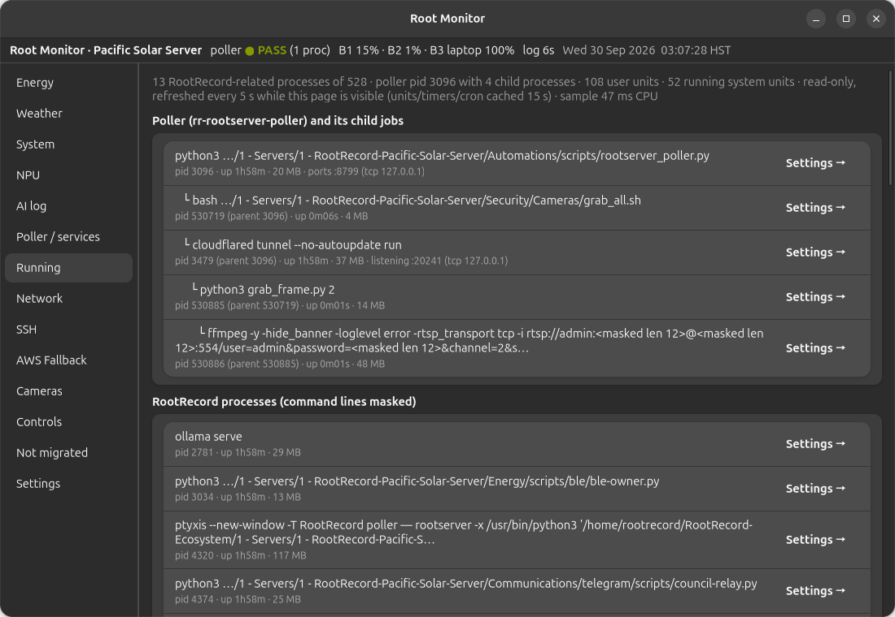

A read-only process map. Refreshes every 5 seconds while you stay here. Units, timers, and cron are cached 15 seconds. Command lines are masked (the `sed` row in the screenshot hides a token pattern).

The summary line on this capture:

> 13 RootRecord-related processes of 528 · poller pid 3096 with 4 child processes · 108 user units · 52 running system units · sample 47 ms CPU

### Poller and its child jobs

Each row is pid, uptime, RSS, and listening ports. **Settings →** jumps to the Settings sub-page that owns that process.

At 03:07 the tree was `rootserver_poller.py` (pid 3096, up 1h58m, 20 MB, port **8799**), then children: `grab_all.sh`, `cloudflared` listening on **20241**, and `grab_frame.py` with an ffmpeg child. A camera grab in that tree is the poller doing its job. This page does not start or stop it.

### RootRecord processes

Everything related that is not in that tree. On this capture the first rows were `ollama serve` (pid 2781, 29 MB) and `ble-owner.py`.

### Listening ports

A single line of local TCP ports, with names for the ones the panel knows:

| Port | Name |
| --- | --- |
| 8799 | poller HTTP |
| 8791 | cam_server |
| 11434 | Ollama |
| 52625 | FLM |
| 631 | cups |
| 53 | dns |

### Tunnels

cloudflared and anything else that looks like a tunnel. The note on the summary row: the poller's `tunnel_start` runs cloudflared as a child. Whether `rr-aws`'s ProxyCommand binary exists is on the SSH page, not here.

### Ollama and FLM

Ollama: up or not, version, and which models are loaded (name, size, VRAM). Empty "no model loaded" is normal when nothing has called it.

FLM: the same idle/busy state as the NPU page, plus whether port 52625 is open.

### systemd

RootRecord-related **user** units first (names matching `rr-`, `ava-`, `network-globe`, `ollama`, `cloudflared`, and the rest of that list). An expander opens **all user units**. System units that are running, related ones first, then an expander for the others.

### Timers and cron

User timers, system timers, your crontab with secrets masked, and system cron entries.

Click **Settings →** on a row when you want the file that configures it. The jump is navigation. It does not change the process.

---

## Network

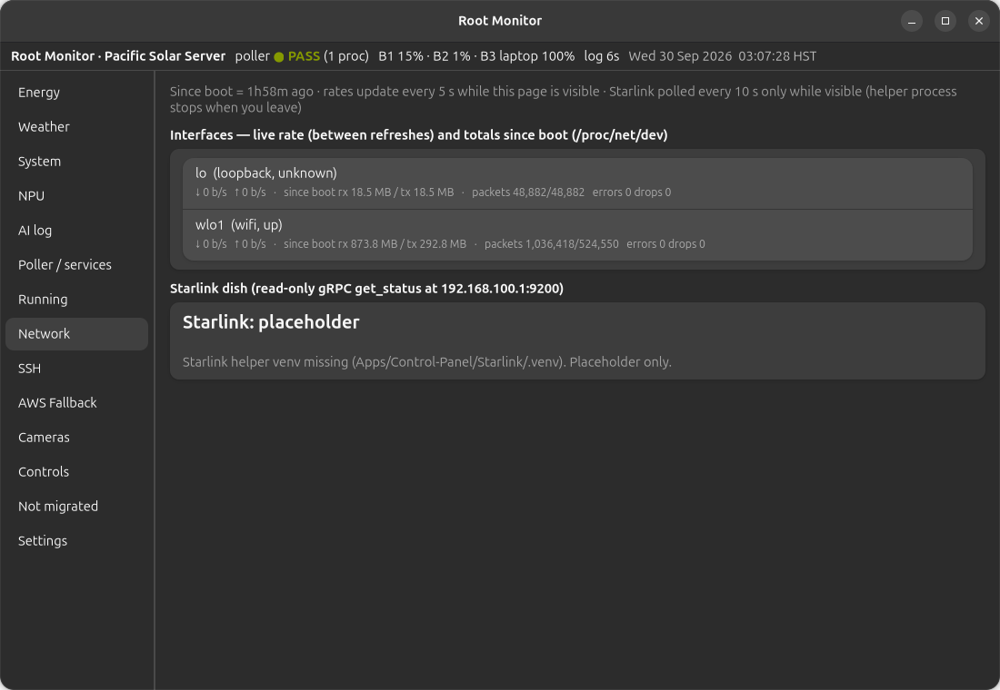

Rates update every 5 seconds **while this page is visible**. Starlink is polled every 10 seconds or slower, and only while you are here. Leave the page and the helper process is stopped.

### Interfaces

From `/proc/net/dev` plus sysfs. Each row: name, kind, state, link speed if any, down/up rate between refreshes, bytes since boot, packet counts, errors, drops.

This capture, uptime 1h58m:

| Interface | State | Since boot |
| --- | --- | --- |
| `lo` | loopback | 18.5 MB in each direction |
| `wlo1` | wifi, up | rx 873.8 MB / tx 292.8 MB · 0 errors · 0 drops |

Rates were 0 B/s at the instant of the shot. That is one sample, not a dead link. The totals say the interface has moved hundreds of megabytes since boot.

### Starlink

Read-only gRPC `get_status` to the dish at `192.168.100.1:9200`, through `Starlink/starlink_status.py` in its own virtualenv.

On this desk the helper venv is missing (`Apps/Control-Panel/Starlink/.venv`), so the card says **Starlink: placeholder**. No dish query is attempted. When the helper exists and `starlink_enabled` is on, the card shows state, uptime, PoP ping latency and drop, downlink/uplink, obstruction, alerts, and software version.

Turn the helper on or off, and the poll interval (minimum 10 seconds), under **Settings → Panel**. Saving there does not install the venv. The venv is a separate setup.

---

## SSH

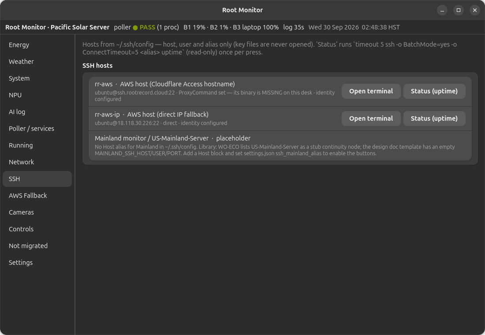

Hosts come from `~/.ssh/config`. You see alias, user, host, and port. Key files are never opened. Identity is "configured" or "default".

Nothing on this page runs until you press a button.

| Host | What the row said | Buttons |
| --- | --- | --- |
| **rr-aws** | AWS host via the Cloudflare Access hostname. `ubuntu@ssh.rootrecord.cloud:22`. ProxyCommand is set, and **its binary is missing on this desk**. | Open terminal · Status (uptime) |
| **rr-aws-ip** | AWS host by direct IP. `ubuntu@18.118.30.226:22`. Direct. Identity configured. | Open terminal · Status (uptime) |
| **Mainland** | Placeholder. There is no Host block yet. | none, until you add one |

**Open terminal** starts a terminal already aimed at that alias.

**Status (uptime)** runs one read-only check, at most 5 seconds:

```bash
timeout 5 ssh -o BatchMode=yes -o ConnectTimeout=5 <alias> uptime
```

The row subtitle becomes `checking…`, then `PASS` or `FAIL` plus the uptime line and the time. FAIL with rc 124 is the 5-second timeout. This does not open a shell you can type into.

**rr-aws** will fail that check while the ProxyCommand binary is missing. Use **rr-aws-ip** for a direct check. AWS Fallback on this desk is set to `rr-aws-ip` for that reason.

**Mainland.** Add a `Host` block to `~/.ssh/config`, then set `ssh_mainland_alias` in Settings → Panel to that alias and save. The buttons appear on the next time the SSH page is built (leave the page and come back, or restart the panel).

---

## AWS Fallback

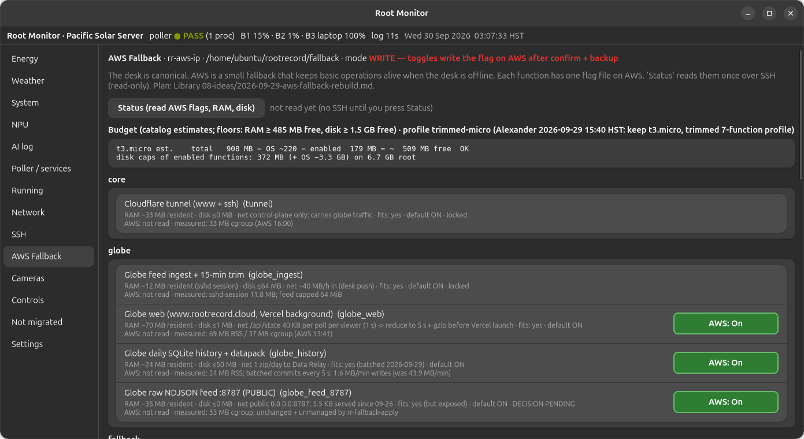

Read this banner before you touch a button.

> **WRITE — toggles write the flag on AWS after confirm + backup**

The desk is canonical. AWS is a small fallback that keeps basic operations alive when the desk is offline. One function, one flag file under `/home/ubuntu/rootrecord/fallback` on alias **rr-aws-ip**.

The page is built when you open it and thrown away when you leave. There is no timer and no background SSH.

### Status

**Status (read AWS flags, RAM, disk)** is the only read. One SSH to `rr-aws-ip`, at most about 10 seconds. Until you press it, every row says `AWS: not read` and the button state is the catalog default, not the live flag.

After a successful read, each row's subtitle shows the real ON/OFF, and the budget card adds measured MemAvailable, disk free, and whether the runtime is deployed.

### Budget

Catalog estimates for the trimmed-micro profile (Alexander, 29 September 2026, 15:40 HST: keep t3.micro, seven functions). Floors: **RAM at least 485 MB free**, **disk at least 1.5 GB free**.

On this capture, before any live read:

> t3.micro est. total 908 MB − OS ~220 − enabled 179 MB = ~509 MB free **OK**
> disk caps of enabled functions: 372 MB (+ OS ~3.3 GB) on 6.7 GB root

If you turn functions on, this line updates from the catalog before anything is written, so you can see a BELOW FLOOR warning in the confirm dialog.

### The rows

Groups, top to bottom. Locked rows have no button.

| Group | Function | Default | Button |
| --- | --- | --- | --- |
| core | Cloudflare tunnel (www + ssh) | ON | locked |
| globe | Globe feed ingest + 15-min trim | ON | locked |
| globe | Globe web | ON | AWS: On |
| globe | Globe daily SQLite history + datapack | ON | AWS: On |
| globe | Globe raw NDJSON feed :8787 (PUBLIC) | ON | AWS: On · **DECISION PENDING** |
| fallback | Desk online/offline watch | ON | toggle |
| fallback | Buffer packets to Data Relay when desk is offline | ON | toggle |
| fallback | Send relay packets to Telegram while FALLBACK | OFF | toggle · **NEEDS SIGN-OFF** |
| status | Status JSON for website /status | OFF | toggle |
| status | System sample (60 s) | OFF | toggle |
| status | Public IP change notice | OFF | toggle |
| comms | Telegram inbox hold | OFF | toggle · **NEEDS SIGN-OFF** |
| comms | Basic canned replies (no LLM) while desk offline | OFF | toggle · **NEEDS SIGN-OFF** |
| hazard | Geology current (USGS / HVO, 5 min) | OFF | toggle |
| hazard | NWS weather current-only (10 min) | OFF | toggle |
| optional | Hawaii news / web facts | OFF | toggle |
| legacy | Legacy git fetch every 1 s (retire) | OFF | toggle |
| legacy | Legacy 1 s poller (retire) | OFF | toggle |
| no-fit | Full Weather scheduler | OFF | locked |

### What a click does, in write mode

1. The button flips.
2. A confirm dialog names the function, prints the exact SSH change, and shows RAM free after the change.
3. **Cancel** puts the button back. Nothing is written.
4. **Apply** takes a dated backup on AWS (`~/rootrecord/bin.bak-fallback-flags-<timestamp>/`), then writes that one flag.
5. A toast says the flag moved, or that the write failed and the button has been put back.

Service flags are applied on AWS by `rr-fallback-apply`. Root Monitor does not restart AWS services itself.

`relay_send`, `telegram_hold`, and `basic_replies` are marked NEEDS SIGN-OFF in the dialog. Treat that line as a stop for anyone who is not Alexander.

If `aws_fallback_mode` is ever set back to `dry-run`, the same dialog appears and then writes nothing. A toast says `dry-run: <id> not written`.

---

## Cameras

The viewer is **off** in `settings.json`. Off means the panel does no camera work: no timer, no directory scan, no JPEG decode, no HTTP fetch.

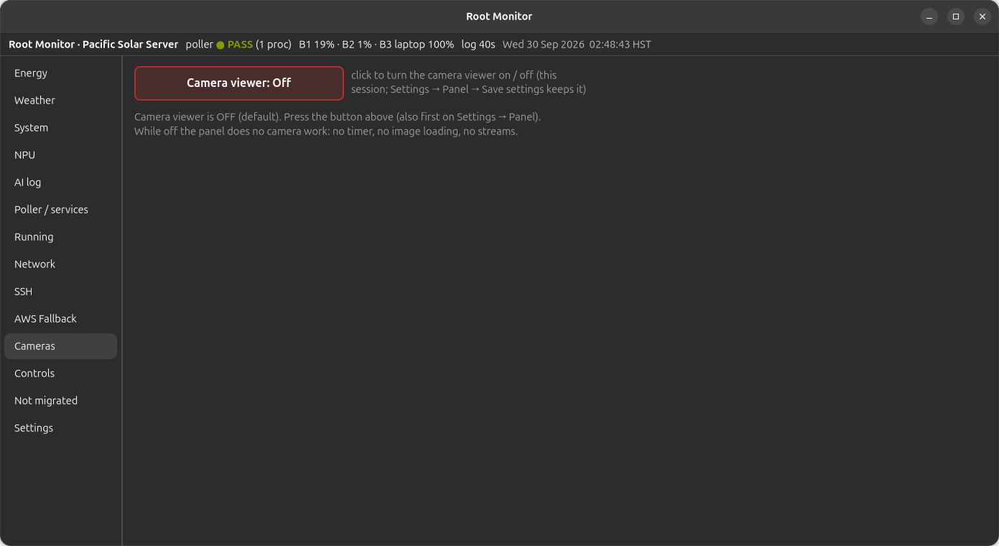

Press **Camera viewer: Off**. It turns green and says **On**. That change is for this run of the window immediately. It does not survive a restart until you press **Save settings** at the bottom of **Settings → Panel**. The same button is the first row there. The two stay in sync.

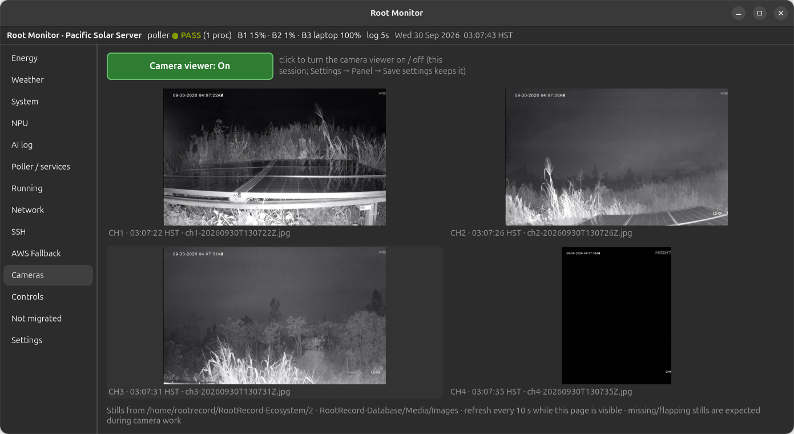

While the page is visible and the viewer is on, stills refresh every **10 seconds** (`camera_refresh_sec`). Leave the page and the pictures are dropped.

Channels come from `Security/Cameras/grab_all.sh` (`ch1`–`ch4`). Stills are the newest JPEG per channel under `2 - RootRecord-Database/Media/Images/`.

On this capture, all four loaded from disk:

| Tile | Still |
| --- | --- |
| CH1 | 03:07:22 HST · `ch1-20260930T130722Z.jpg` · panels and grass, night IR |
| CH2 | 03:07:26 HST · `ch2-20260930T130726Z.jpg` · grass and a panel edge, night IR |
| CH3 | 03:07:31 HST · `ch3-20260930T130731Z.jpg` · trees and grass |
| CH4 | 03:07:35 HST · `ch4-20260930T130735Z.jpg` · a dark frame |

A dark frame is still a frame. The caption shows the file time. **Missing or flapping stills are expected during camera hardware work.** The caption then says `no still on disk`. If local fallback is on, the panel fetches one JPEG from `http://127.0.0.1:8791/` for that channel only, and only while you are looking. It never reads `CONNECTION.json` on this page. Credentials stay on Settings → Cameras, masked.

**Show ch1** … **Show ch4** on Settings → Panel hide a tile in this window. They do not disable the grab job.

The "On" picture above was taken by the handbook capture, which turned the viewer on in memory for that shot. It did not save `settings.json`. After a normal launch the button is **Off** again.

---

## Controls

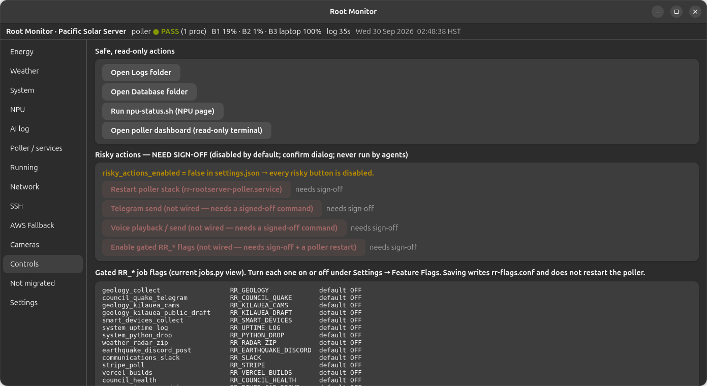

### Safe

These four are ordinary buttons:

| Button | Effect |
| --- | --- |
| Open Logs folder | file manager on the Logs directory |
| Open Database folder | file manager on the database root |
| Run npu-status.sh (NPU page) | switches to NPU and runs the script once |
| Open poller dashboard (read-only terminal) | ptyxis window, same as on the Poller page |

### Risky — need sign-off

All four are grey. The amber line says why:

> `risky_actions_enabled = false` in settings.json → every risky button is disabled.

| Button | Wired? |
| --- | --- |
| Restart poller stack (`rr-rootserver-poller.service`) | command exists, `signed_off` is false |
| Telegram send | no command |
| Voice playback / send | no command |
| Enable gated RR_* flags | no command |

A risky button becomes clickable only when **all three** are true: `risky_actions_enabled` is true, that action has `"signed_off": true`, and it has an `argv`. The click still opens a confirm dialog whose default button is Cancel. Turning on "Allow risky actions" under Settings → Panel asks for confirmation first. Agents must not click these. Enabling them is a sign-off item.

### Gated job flags

A read-only list from `jobs.py`: job id, `RR_*` flag, and the code default. On this capture every visible default was OFF, starting with `RR_GEOLOGY`, `RR_COUNCIL_QUAKE`, `RR_KILAUEA_CAMS`, `RR_KILAUEA_DRAFT`, `RR_SMART_DEVICES`, `RR_UPTIME_LOG`, `RR_PYTHON_DROP`, `RR_RADAR_ZIP`, `RR_EARTHQUAKE_DISCORD`, `RR_SLACK`, `RR_STRIPE`, `RR_VERCEL_BUILDS`, and `RR_COUNCIL_HEALTH`. Thirty-seven flags in all. Scroll for the rest.

To change one, go to **Settings → Feature Flags**. Saving writes `~/.config/systemd/user/rr-rootserver-poller.service.d/rr-flags.conf` the first time, and does **not** restart the poller. The row tells you the new value is used the next time that service starts.

---

## Not migrated

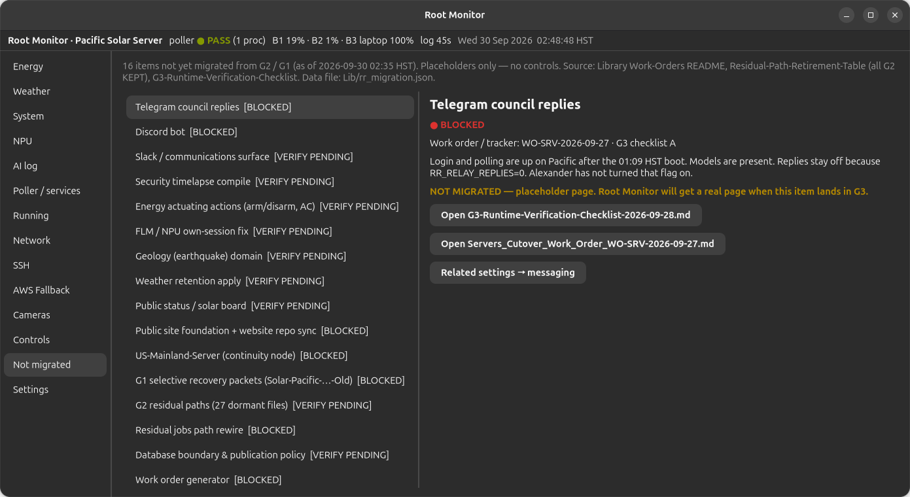

Sixteen items that are not in this panel yet, as of 30 September 2026, 02:35 HST. Placeholders only. No start buttons, no flags, no "migrate" action.

**7 BLOCKED, 9 VERIFY PENDING.** Closed work orders are not listed.

| Item | State |
| --- | --- |
| Telegram council replies | BLOCKED |
| Discord bot | BLOCKED |
| Slack / communications surface | VERIFY PENDING |
| Security timelapse compile | VERIFY PENDING |
| Energy actuating actions (arm/disarm, AC) | VERIFY PENDING |
| FLM / NPU own-session fix | VERIFY PENDING |
| Geology (earthquake) domain | VERIFY PENDING |
| Weather retention apply | VERIFY PENDING |
| Public status / solar board | VERIFY PENDING |
| Public site foundation + website repo sync | BLOCKED |
| US-Mainland-Server (continuity node) | BLOCKED |
| G1 selective recovery packets | BLOCKED |
| G2 residual paths (27 dormant files) | VERIFY PENDING |
| Residual jobs path rewire | BLOCKED |
| Database boundary & publication policy | VERIFY PENDING |
| Work order generator | BLOCKED |

Click a name in the inner sidebar. You get the work-order id, a short note, **Open** buttons for the source documents (greyed if the file is missing), and sometimes **Related settings →** which jumps into Settings.

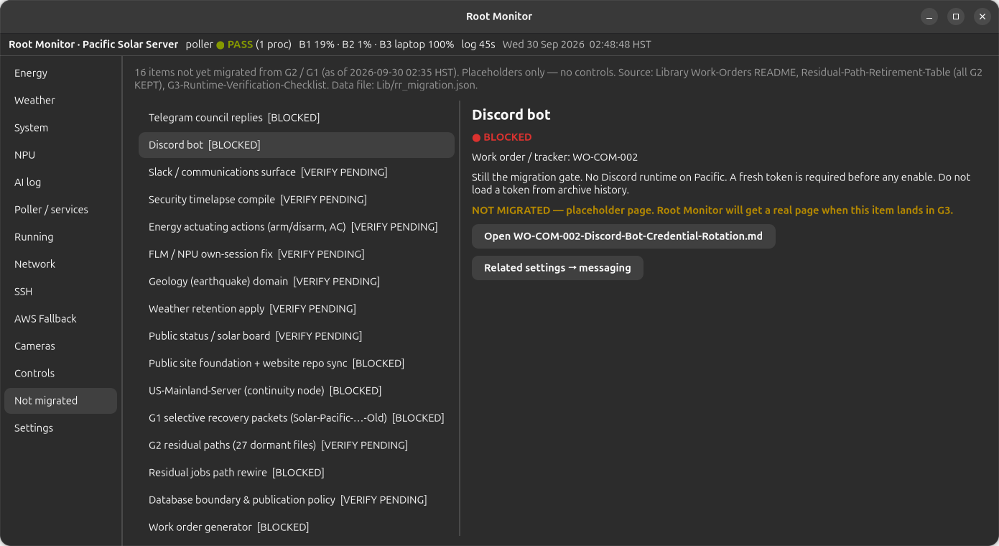

Discord, as an example: still the migration gate. No Discord runtime on Pacific. A fresh token is required before any enable. The page tells you not to load a token from archive history. The button opens `WO-COM-002-Discord-Bot-Credential-Rotation.md`.

Red **BLOCKED** and amber **VERIFY PENDING** are labels, not actions. A real page replaces the placeholder when that item lands. The list lives in `Apps/Control-Panel/Lib/rr_migration.json`.

---

## Settings

Settings is the other half of the program: every configuration row the registry knows, in one place.

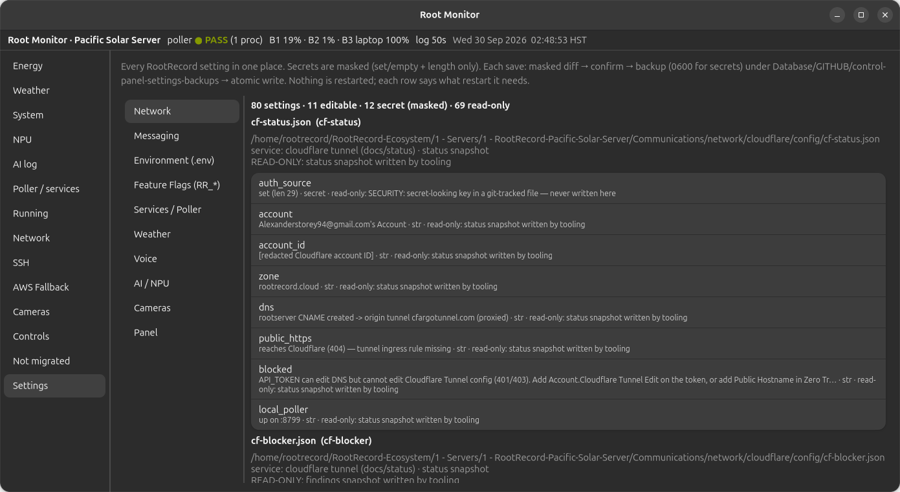

The sentence at the top is the whole contract:

> Every RootRecord setting in one place. Secrets are masked (set/empty + length only). Each save: masked diff → confirm → backup (0600 for secrets) under `Database/GITHUB/control-panel-settings-backups/` → atomic write. Nothing is restarted; each row says what restart it needs.

A sub-page is built when you select it and released when you pick another, so the window does not hold every file at once.

Inner sidebar:

| Sub-page | On this capture | What you are looking at |
| --- | --- | --- |
| Network | 80 settings · 11 editable · 12 secret · 69 read-only | Cloudflare status snapshots, tunnel token (masked), poller bind/port |
| Messaging | 44 · 30 editable · 14 secret · 14 read-only | `relay.conf`, voice table |
| Environment (.env) | 64 · 23 editable · 35 secret · 41 read-only | `master-key.env`, GitHub CLI config, security items |
| Feature Flags (RR_*) | 101 · 100 editable · 1 secret · 1 read-only | poller environment flags |
| Services / Poller | 208 · 100 editable · 2 secret · 108 read-only | units, `devices.conf`, `repos.conf`, jobs table |
| Weather | 558 · 104 editable · 0 secret · 454 read-only | weather YAML plus retention constants |
| Voice | 139 · 0 editable · 1 secret · 139 read-only | Kokoro `config.json`, never edited |
| AI / NPU | 483 · 443 editable · 0 secret · 40 read-only | `ollama.service` (read-only, needs sudo) and specialist routes |
| Cameras | 16 · 7 editable · 7 secret · 9 read-only | A-EYES passwords and `CONNECTION.json`, all masked |
| Panel | the panel's own `settings.json` | dedicated controls, not a raw key list |

Counts are rows on that sub-page, including read-only lines. They move when files gain keys.

### How a row works

Each row shows the key, the type, whether a restart is required, and the value.

- **Green `Name: On` / red `Name: Off`.** Click, confirm, write. Used for `bool01` values: relay `ENABLED`, repo `enabled`, every `RR_*` flag, device poll on/off.
- **Edit…** opens a confirm with the new text. The diff you are shown is masked if the value is secret.
- **Replace… / Clear** on a secret. You type into a password entry. The old value is never shown, only `set (len N)` or `empty`.
- **Read-only** rows have no button. The reason is on the row: status snapshot, system unit in `/etc`, model file, Python source, secret-looking key inside a git-tracked file.

A save does not restart the poller, the relay, BLE, or Ollama. The row's own line says when the new value is picked up: "takes effect after rr-rootserver-poller.service restart", "read at each job run (no restart)", "takes effect after weather poller restart", and so on.

### Network

Status files `cf-status.json` and `cf-blocker.json` are snapshots written by tooling. You can read `zone` (`rootrecord.cloud`), whether local poller is up on `:8799`, and the blocker note (API token can edit DNS but not tunnel config). `auth_source` is called out as a secret-looking key in a git-tracked file and is never written from here. The tunnel token file is a real secret: length only.

### Messaging

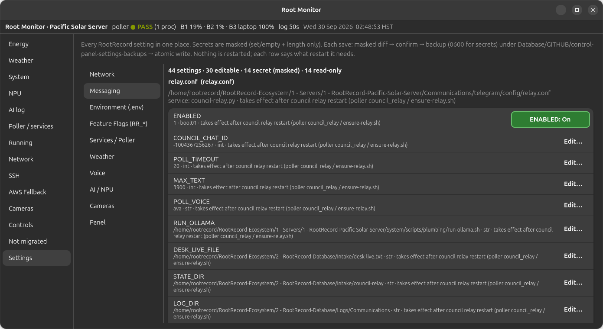

`relay.conf` for `council-relay.py`. On this capture **ENABLED** was **On** (value `1`). Chat id, poll timeout `20`, max text `3900`, poll voice, and the Ollama runner path are editable strings. They take effect after a council relay restart. Tokens in the voice table stay masked. `token_env` cells are names of variables, not the tokens, so they are shown.

### Environment

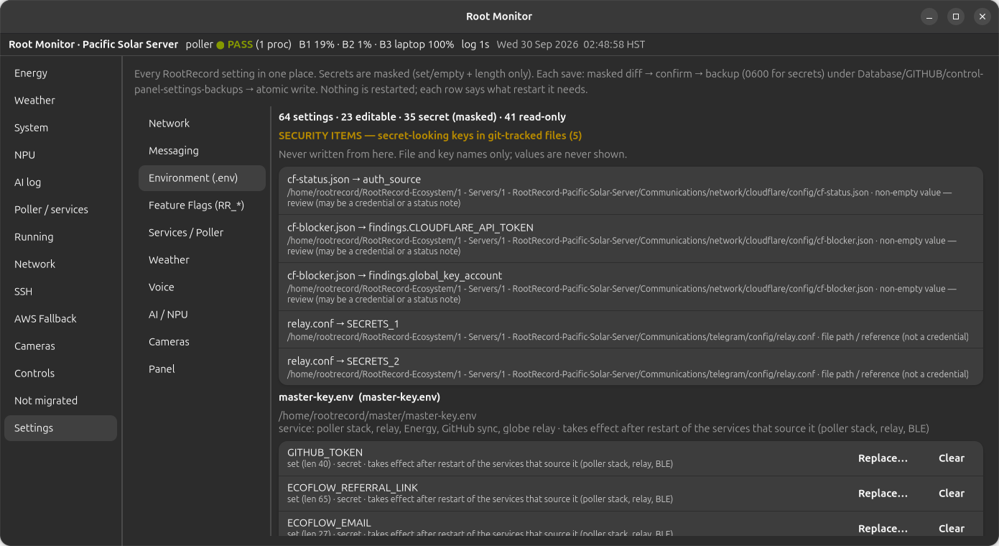

A yellow **SECURITY ITEMS** block lists secret-looking keys that live in git-tracked files. Five were listed, including `cf-status.json → auth_source` and empty-looking token keys in `cf-blocker.json`. File and key names only. Values are never shown, and these rows are never written.

Under that, `~/master/master-key.env`. `GITHUB_TOKEN`, EcoFlow referral link, and EcoFlow email show as `set (len N)` with **Replace…** and **Clear**. Clearing a secret is a confirm. The services that source this file (poller stack, relay, BLE) keep the old value until they restart.

GitHub CLI `hosts.yml` / `config.yml` are read-only because `gh auth` and `gh config` own them.

### Feature flags

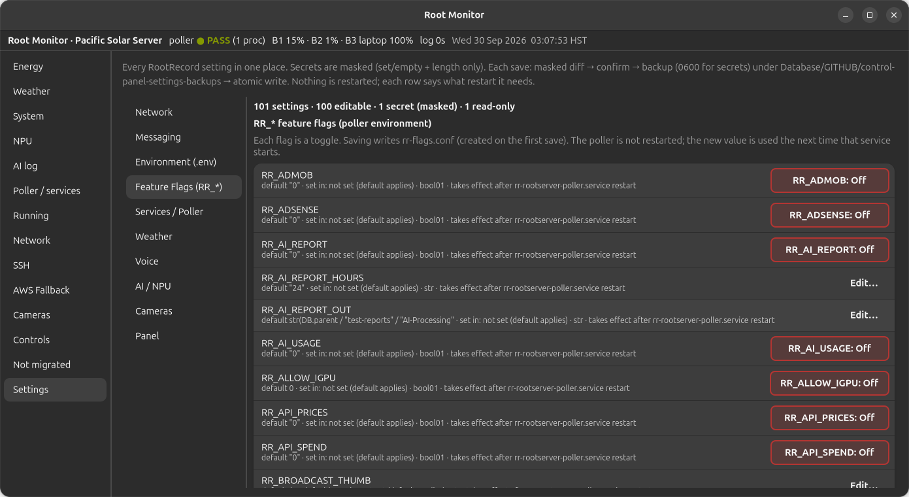

One hundred flags, almost all editable. The intro line:

> Each flag is a toggle. Saving writes `rr-flags.conf` (created on the first save). The poller is not restarted. The new value is used the next time that service starts.

Until that file has a line for a flag, the button shows the code default and the subtitle says `not set (default applies)`. On this capture `RR_ADMOB`, `RR_ADSENSE`, `RR_AI_REPORT`, `RR_AI_USAGE`, `RR_ALLOW_IGPU`, `RR_API_PRICES`, and `RR_API_SPEND` were **Off**. `RR_AI_REPORT_HOURS` is a string (`24`), so it has **Edit…** instead of a toggle.

Turning a flag On here is not the same as the grey "Enable gated RR_* flags" button on Controls. This page writes the drop-in file. It still does not restart the poller.

### Services / Poller

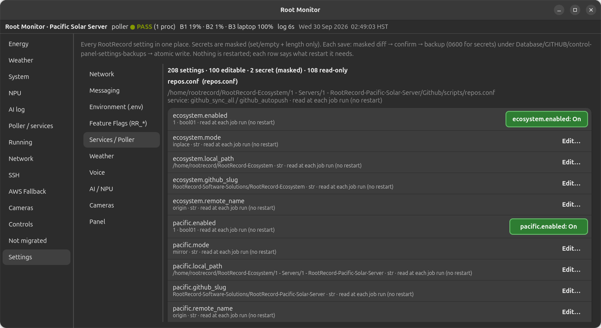

The largest operational page: poller unit keys (exec lines read-only), the logging drop-in, `ava-ecoflow-ble.service`, EcoFlow `devices.conf` (`prefer_api`, `poll_enabled`, intervals), the read-only job table from `jobs.py`, and `repos.conf`.

`repos.conf` is read at each `github_sync` / autopush, no restart. On this capture **ecosystem.enabled** and **pacific.enabled** were **On**, both `mode` `inplace` or `mirror` as labelled, paths under the ecosystem tree, remote name `origin`. Edit a path only when you mean to move a repo. A bad path makes the next sync fail; it does not roll back by itself. The backup of the file is the rollback.

### Weather

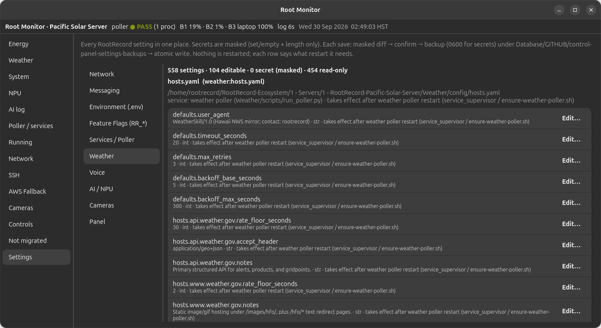

558 rows. Most are read-only structure. The editable ones are scalars in `hosts.yaml`, `tiers.yaml`, `resources.yaml`, `counties.yaml`, `report_counties.yaml`, and `text_cleaning.yaml`. They take effect after the weather poller restarts (`service_supervisor` / `ensure-weather-poller.sh`).

The top of `hosts.yaml` on this capture: user agent `WeatherSkill/1.0`, timeout 20 seconds, 3 retries, backoff 5 to 300 seconds. Retention windows (`KEEP_*_DAYS` in `weather-retention.py`) are Python constants, shown read-only, because that job is gated off and a change is a code change plus a dry run.

### Voice

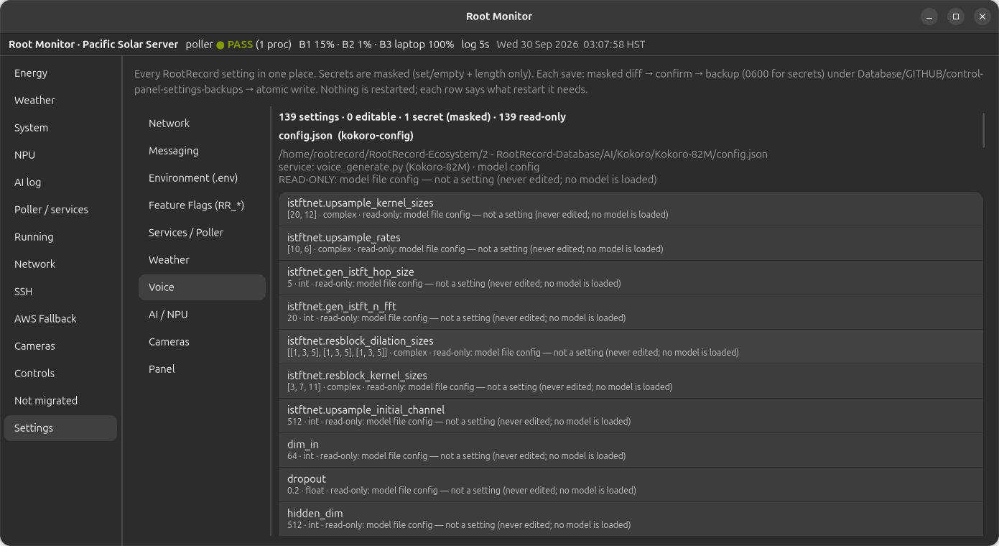

139 rows, none editable. This is `AI/Kokoro/Kokoro-82M/config.json`. The panel says model file config, not a setting, and it does not load the model. You are looking so you can see `dim_in`, sample rates, and kernel sizes without opening the file. Change voice behavior through flags and `voices.conf`, not through these numbers.

### AI / NPU

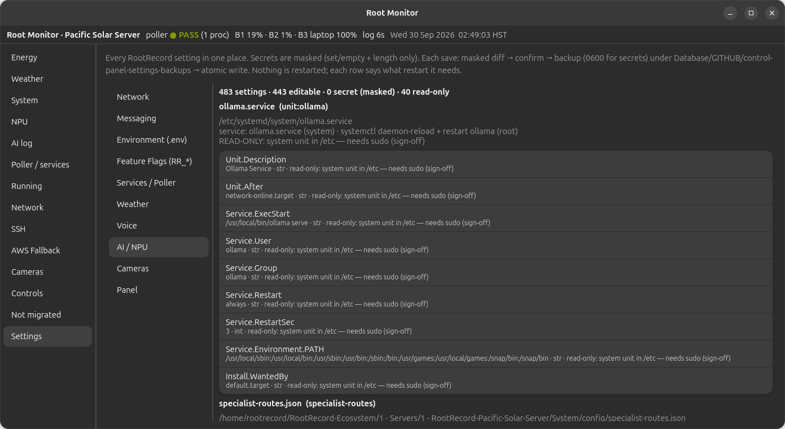

`/etc/systemd/system/ollama.service` is shown in full and cannot be written: system unit, needs sudo, sign-off. You can read ExecStart (`/usr/local/bin/ollama serve`), user `ollama`, `Restart=always`.

Below it, `System/config/specialist-routes.json` is editable (thresholds, keyword weights). It is read at each inference. Keyword weights that happen to contain the letters "token" or "password" are weights, not credentials, and are shown.

### Cameras

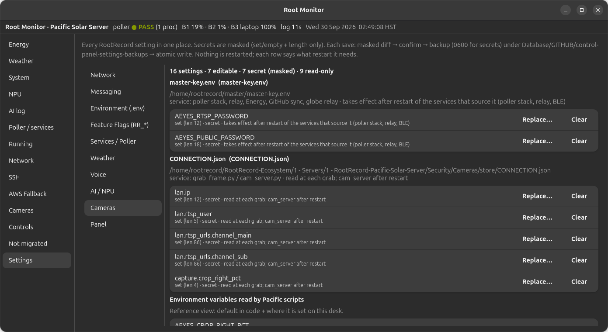

16 settings. `AEYES_RTSP_PASSWORD` and `AEYES_PUBLIC_PASSWORD` from `master-key.env` are `set (len 12)` and `set (len 18)`. `CONNECTION.json` (LAN IP, RTSP user, URLs, crop) is a secret file: every value masked, **Replace…** / **Clear** only. Read at each grab; `cam_server` sees connection changes after it restarts.

This is the only page that parses `CONNECTION.json`. The Cameras viewer never does.

### Panel

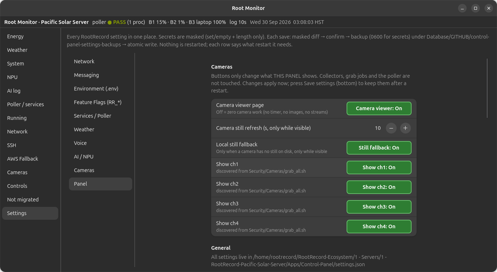

This sub-page is not the registry list. It edits Root Monitor's own `settings.json` with real controls. Changes to camera buttons apply to the open window immediately. **They are not kept across a restart until you press Save settings** at the bottom of this page.

**Cameras**

| Control | What it does | On disk at capture |
| --- | --- | --- |
| Camera viewer page | Show stills or do nothing | **false** (Off). The screenshot says On because the capture turned the viewer on in memory before it opened this sub-page. A normal launch shows Off. |
| Camera still refresh | 5–120 seconds, only while the page is visible | 10 |
| Local still fallback | One localhost JPEG when a channel has no file | On |
| Show ch1–ch4 | Hide or show that tile | all On |

**General** (scroll past the camera card)

| Control | Default on this desk |
| --- | --- |
| Refresh interval | 5 s (range 2–60) |
| Mark SOC stale after | 900 s |
| Poller log lines shown | 40 |
| Weather island | Big Island (buttons on the Weather page; also Maui, Oahu, Kauai) |
| Start page | energy. Cameras is refused as a start page. |
| GTK renderer | `cairo` (lightest). Applies on next start. |
| Starlink | On, poll 10 s minimum. Does nothing without the helper venv. |
| Mainland SSH alias | empty |

**Paths** are the database root and the Pacific repo root. They are editable here because the panel has to know where to read. Pointing them somewhere else makes every page look at the wrong tree. Save only if the trees have actually moved.

**Safety — NEEDS SIGN-OFF.** "Allow risky actions" is Off. Turning it On opens a confirm: poller restart, Telegram, voice, and RR_* need Alexander's sign-off. Even after it is on, each risky action still needs `signed_off` and a command in `settings.json`, and a second confirm at the moment you run it.

**Execution gates.** Below that card, Settings → Panel lists the gates in `execution-gates.json`. The broker reads that file on its own. The panel does not grant permission by being open. Turning a gate On asks for confirm. Turning it Off writes immediately. `cursor_api`, commit, push, merge, deploy, recovery run, and raising the attempt cap ship Off. Opening Build does not open Deployment. Agents must not toggle these. The seed copy lives at `Apps/Control-Panel/execution-gates.json`. The live copy the broker prefers is Database `System/control-panel/execution-gates.json`. If the live file is missing, the broker uses the seed.

**Known URLs.** Name and URL only. Click a row to open it with `xdg-open`. The pencil edits, the trash removes, the plus adds. A URL with `user:pass@` or a token, key, or password query parameter is refused.

The seed list:

| Name | URL |
| --- | --- |
| Poller status line (local /health) | `http://127.0.0.1:8799/` |
| Poller energy JSON | `http://127.0.0.1:8799/energy` |
| Poller system-status JSON | `http://127.0.0.1:8799/system-status.json` |
| RootServer public (tunnel) | `https://rootserver.rootrecord.cloud/` |
| A-EYES cameras (public, login) | `https://rootserver.rootrecord.cloud/aeyes` |
| A-EYES cameras (local, login) | `http://127.0.0.1:8791/aeyes` |
| Ollama models | `http://127.0.0.1:11434/api/tags` |
| FLM / NPU models (on demand) | `http://127.0.0.1:52625/v1/models` |

**Save settings** writes `Apps/Control-Panel/settings.json` and restarts the refresh timer so a new interval applies now. A toast says `Saved settings.json`. Paths are re-read. The poller is not restarted.

---

## What a confirm dialog is protecting

Every write in this program goes through the same shape:

1. You see the change in words, or a masked diff.
2. The default button is **Cancel**.
3. The confirm button is the one that writes.
4. A backup is taken first. Secret backups are mode `0600`, under `Database/GITHUB/control-panel-settings-backups/`.
5. The write is atomic.
6. Nothing is restarted for you.

If a save fails, a toast says `Save failed: …` and the previous file is the backup you just made.

AWS is the exception in destination, not in shape: the backup is on the AWS home directory, and the write is one flag file over SSH. Cancel still writes nothing.

---

## What Root Monitor will not do

- It will not restart the poller unless risky actions are signed off and you confirm the restart button. That path is off.
- It will not send Telegram, play voice, or flip a gated job from the Controls page. Those buttons have no command.
- It will not arm or disarm a battery, or switch AC. That work is a Not-migrated placeholder.
- It will not start the cameras, the grab jobs, or the poller.
- It will not push git. The Running page can show a push the poller already started.
- It will not start a Cursor build by itself. `cursor_api` ships Off. Opening that gate is a confirm, and the broker still requires a numeric Telegram id and a handoff package.
- It will not print a secret into a label, a toast, a log line, or a screenshot.
- It will not keep working on a page you have left. Starlink, camera decode, and the AWS widget tree stop or are freed.

---

## This capture, as a shift note

30 September 2026, about 03:07 HST. Use it as an example of how to talk about the screen, not as the current state.

The poller was PASS, one process, pid 3096, log written within the last few seconds. All eight service rows were PASS. BLE was up, so the stale Delta was not "BLE is down."

B1 River 2 Pro was at 15.1% and fresh over BLE, AC out 38 W, USB-C out 14 W, solar 0 W. B2 Delta 2 was at 1% and the sample was 2 hours 14 minutes old, source API, so it was marked STALE. The laptop was full and on AC. The Delta expansion field was absent from the ENERGY line.

The host was quiet: CPU 5.4% (green), RAM 69.9% (amber, under the 80% red line), load under 1. NPU `accel0` present, FLM idle, lock idle. AI log had 11 old NPU requests and none since midnight. Weather opened on Big Island stations (63 reporting, Hilo and Kona both up). The zone-forecast file was not on disk, and the solar table was empty. Wi-Fi `wlo1` was up, about 874 MB received since boot. Starlink was a placeholder because the helper venv is not installed. `rr-aws` has a ProxyCommand whose binary is missing; `rr-aws-ip` is the direct host. AWS Fallback was in **write** mode and had not been read yet this session. Cameras had four fresh stills on disk and the viewer was off on disk. Risky actions were off. Sixteen migration placeholders were still open.

---

## If the window looks wrong

| What you see | What it usually means |
| --- | --- |
| Header poller **FAIL** | The poller process or its unit is not in the expected state. Open Poller / services. The panel will not restart it. |
| Log age climbing | `automations_current.log` is not being written. Same page, then the log view. |
| **STALE** under B1 or B2 | That pack's last JSON is older than `stale_after_sec` (15 minutes). Check BLE on the services page and `ble-owner.py` on Running. |
| CPU or RAM bar red | That reading is 80% or higher. Under 50% is green. Between 50 and 80 is amber. |
| Battery bar red | That pack is under 20%. Full charge is green. The battery scale is the opposite of CPU and RAM. |
| Weather station list empty | `oso_hourly_obs_current.md` is missing. The reports-folder button opens the directory. |
| Today and Tonight are dashes | The zone forecast file `zfp_zone_forecast_current.md` is not on disk. The station list above it is still the live report. |
| Starlink: placeholder | `Apps/Control-Panel/Starlink/.venv` is not there. |
| Starlink: not reachable | Helper ran and the dish at `192.168.100.1:9200` did not answer. |
| SSH rr-aws FAIL immediately | ProxyCommand binary missing, as the row already says. Try rr-aws-ip. |
| AWS rows say "not read" | Status has not been pressed this visit. The buttons are catalog defaults. |
| AWS write failed toast | SSH or the remote flag write returned non-zero. The button is back to the old state. |
| Camera tile "no still on disk" | No JPEG for that channel yet, or the grab is mid-write. Expected during camera work. |
| Second launch does nothing visible | The first window was raised. Look for it. |
| A setting you changed is back after restart | Panel controls need **Save settings**. Other pages write on confirm. Restart of the *service* is still separate, and the row says so. |

---

## Where the program lives

```text
1 - Servers/1 - RootRecord-Pacific-Solar-Server/Apps/Control-Panel/
  rr_control_panel.py     window, Energy through Controls, screenshot mode
  rr_pages.py             Running, Network, SSH, Not migrated, Settings hub
  rr_aws_page.py          AWS Fallback
  rr_ui.py                buttons, rows, redaction
  settings.json           this panel only
  Lib/rr_sources.py       readers
  Lib/rr_registry.py      settings catalog
  Lib/rr_config_io.py     masked diff, backup, atomic write
  Lib/rr_aws_fallback.json
  Lib/rr_migration.json
  Packaging/              launcher, autostart, swap-default-viewer.sh
```

Headless check, no window:

```bash
python3 rr_control_panel.py --check --no-starlink
```

Refresh every picture in this handbook (writes a new timestamped set, then you rename):

```bash
python3 rr_control_panel.py --screenshot "/home/rootrecord/RootRecord-Ecosystem/5 - RootRecord-Library/Guides & Tutorials/Root-Monitor-Operators-Handbook/media"
```

That walk turns the camera viewer on in memory for one shot and does not save settings. It also opens the window on the desktop while it runs, then quits.

---

## Related notes

- App README: `Apps/Control-Panel/README.md`
- Test notes from the days this panel landed:
  - `5 - RootRecord-Library/Documentation/07-testing/2026-09-29-root-monitor-settings-running-network-ssh.md`
  - `5 - RootRecord-Library/Documentation/07-testing/2026-09-29-root-monitor-aws-fallback-page.md`
  - `5 - RootRecord-Library/Documentation/07-testing/2026-09-29-root-monitor-toggle-buttons.md`
