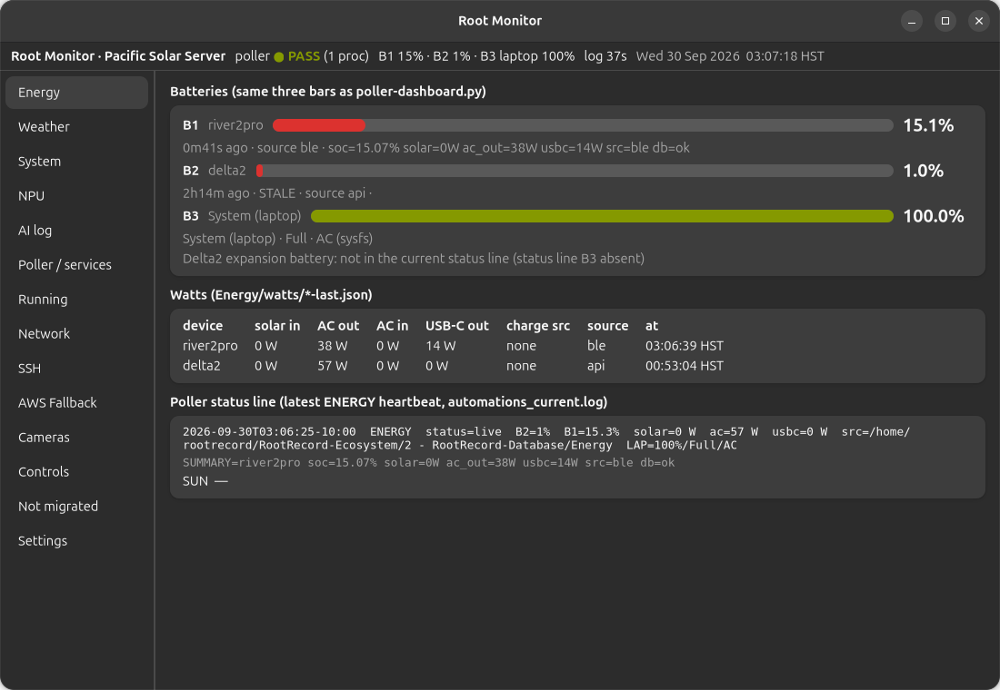

# For a new person

This is the first finished lesson of a course that does not exist yet. The [course map](./Course-map.md) shows the later lessons. They are not written.

You do not need to write code for this lesson. You need to know what you are looking at.

## The desk

One computer in Hawaii runs RootRecord. The programs that matter tonight live in one folder, Pacific, inside the Ecosystem tree. A second folder, Database, holds the readings, pictures, and logs. A third folder, Library, holds the writing, including this page.

The window you see at login is **Root Monitor**. It is a viewer. Closing it does not stop the machines it is watching.

## The first screen

Root Monitor opens on Energy.

The line under the title is the one to read first. On the night this picture was taken it said the poller was passing, then three batteries:

| Name | What it is |
| --- | --- |
| B1 | River 2 Pro. This is the pack that is alive. |
| B2 | Delta 2. This pack died. A reading near empty, or no new reading, is normal. |
| B3 | The laptop you are sitting at, not another power station. |

The rest of the Energy page is watts and the latest status line the poller wrote. Numbers move. The names do not.

The full page-by-page tour, with a picture of every screen, is the [operator's handbook](../Root-Monitor-Operators-Handbook/Root-Monitor-Operators-Handbook.md).

## Three things that look like buttons and are not yours yet

Root Monitor can show a toggle for almost every on/off setting. A toggle is a labeled button that says On or Off. Clicking one asks you to confirm, then writes a file. It does not restart anything by itself.

Leave these off until someone who runs the desk names them:

- Telegram replies
- Voice reports and anything that would play a speaker
- Jobs whose name starts with `RR_`

The public address `https://rootserver.rootrecord.cloud/` is the same poller you see in the window, reached through a tunnel. It is not a website, and there is no local website to start.

## What you would learn next

The [course map](./Course-map.md) is the rest of the class: weather, cameras, how a scheduled job is added, and where Alexander's open decisions are written down. Those lessons are outlined so the shape is visible. They are not the class yet.
